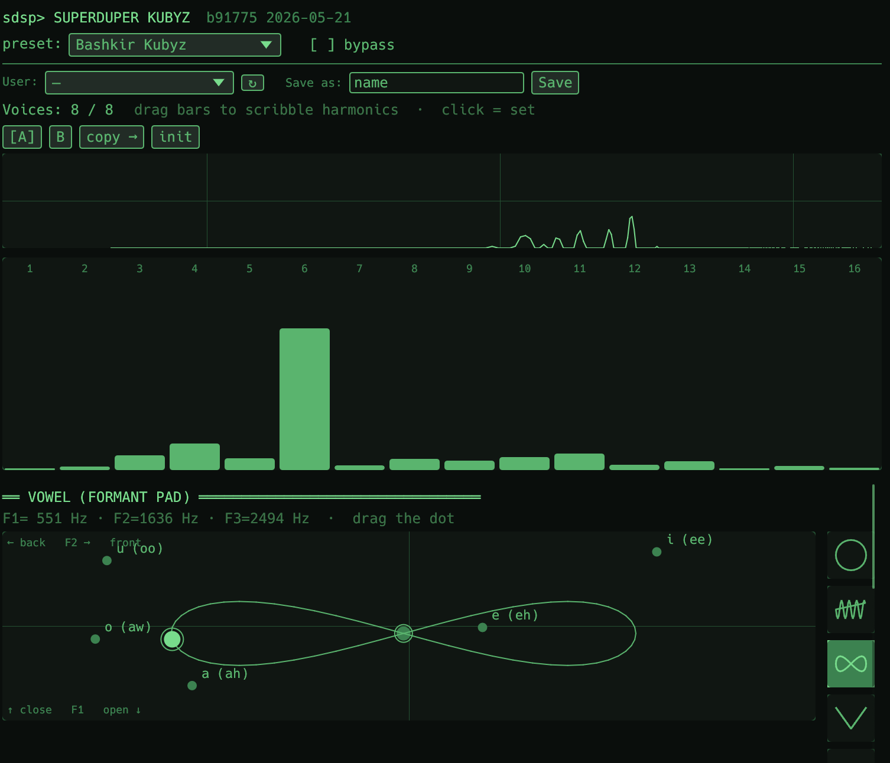

# SuperDuper DSP

Open-source CLAP plugin suite — 31 focused effects and synths written in
Rust. Full vocal chain (de-esser + plosive + hum + de-click + Sub-Mode
for 2-band setups), four original synths (wavetable bass, jaw-harp
physical model, drum machine, polyphonic sampler), Mobius-style live
looper, BS.1770 LUFS meter, linear-phase mastering EQ, dynamic
resonance suppressor (Soothe-style), Neural Amp Modeler (loads
community `.nam` files), custom egui GUIs with a retro phosphor-green
theme, factory presets, sidechain ducking, automation write, MIDI CC
/ pitch-bend, tempo sync, and CLAP state persistence across the family.

[**Download the latest release**](https://github.com/fortunto2/superduper-dsp/releases/latest)
· [Install instructions](INSTALL.md) · [Project notes](CLAUDE.md)

## Screenshots

| Wave (wavetable synth) | Kubyz (jaw harp / khomus) |
|---|---|
|  |  |
| Mouse-editable curve, multi-frame storage (4 frames shown), 11 transforms, smart WAV import, Serum-compatible export | 16-harmonic bar editor, IPA vowel pad with animated Figure-8 mouth trajectory, 3-band formant filter |

## The plugins

Each plugin has its own README with parameters, workflow, and tips —
click the name to read.

### Effects

| Plugin | Use | Highlights |
|---|---|---|
| [**EQ**](effects/superduper-eq/README.md) | tone shaping | 3-band parametric (low shelf + mid peak + high shelf) + HP/LP. RBJ biquad math. |
| [**LinEq**](effects/superduper-lineq/README.md) | mastering EQ | Linear-phase 3-band FIR (~21 ms latency reported to host PDC). Same RBJ biquad target curve, then iFFT-designed symmetric 2048-tap kernel + circular-history convolution. |
| [**Compressor**](effects/superduper-compressor/README.md) | dynamics | Soft-knee feed-forward, 2 ms lookahead, sidechain HPF, external sidechain port, Clean / Pump / Smooth curves, oversampled ceiling clipper, live GR meter + oscilloscope. |
| [**Saturator**](effects/superduper-saturator/README.md) | warmth | Tape / Tube / Soft-tanh with Tone tilt + 2×/4× polyphase oversampling. |
| [**Delay**](effects/superduper-delay/README.md) | rhythm/space | 3rd-order Lagrange interpolation, tape-style feedback saturation, Stereo / Ping-Pong / Slap modes, sidechain ducking. |
| [**Reverb**](effects/superduper-reverb/README.md) | space | Dattorro figure-of-eight plate with modulated allpasses, Lagrange-3 fractional taps for click-free SIZE sweeps. Sidechain ducking. |
| [**Supermass**](effects/superduper-supermass/README.md) | wash | Valhalla-style cascade (reverb → stereo chorus → reverb, 28 s tail), sidechain ducking. |
| [**Limiter**](effects/superduper-limiter/README.md) | mastering | Lookahead brickwall with 4× true-peak detection, TPDF dither, live GR meter. |
| [**Spectrum**](effects/superduper-spectrum/README.md) | metering | Pass-through analyzer + BS.1770 LUFS-M/S/I + dBTP true-peak. Spectrum / Spectrogram / Split view, three colour palettes. |
| [**Vocal**](effects/superduper-vocal/README.md) | restoration | Peaking-EQ de-esser (phase-coherent) with frequency tracker + Plosive Killer + Hum Remover + De-Clicker + Sub Mode for 2-band chains. |
| [**Chorus**](effects/superduper-chorus/README.md) | modulation | Multi-tap modulated delay with band-named factory presets (Joy Division Atmosphere → Cocteau Twins shimmer → Vangelis Blade Runner CS-80 lushness). |
| [**Looper**](effects/superduper-looper/README.md) | live performance | Mobius-style 4-track live looper, 60 s/track, host-BPM sync with bar-aligned quantize, per-track Feedback for tape-style overdub decay, MIDI CC control. |
| [**Filter**](effects/superduper-filter/README.md) | sweep / motion | Multi-mode resonant (LP/HP/BP/Notch) + Drive (Tanh/Tape/Tube) + LFO (free + tempo sync) + Env Follow. Daft-Punk style filter sweeps on the master bus. |
| [**MidSide**](effects/superduper-midside/README.md) | stereo width | L/R ↔ M/S encode/decode + per-channel Mid/Side gain + Width. Three modes: in-place Width, Encode →, ← Decode for inserting M/S processors. |
| [**Soothe**](effects/superduper-soothe/README.md) | resonance suppressor | 24-band dynamic resonance suppressor. Tames rolled-r, harsh `s`/`sh`, mud peaks via baseline-relative peaking-EQ cuts. Soft/Sharp/Hard modes. |
| [**NAM**](effects/superduper-nam/README.md) | neural amp modeler | Pure-Rust port of Steven Atkinson's [Neural Amp Modeler](https://github.com/sdatkinson/NeuralAmpModelerCore) inference. Loads community `.nam` files (WaveNet / LSTM / Linear) with in-plugin library browser: drag-and-drop, URL download, filter, delete, in-app links to [ToneHunt](https://tonehunt.org) / [Tone3000](https://tone3000.com) / [NAM Hub](https://nam.parametric.audio). |
| [**Vocoder**](effects/superduper-vocoder/README.md) | robot voice | Classic channel vocoder (Daft Punk / Kraftwerk / talkbox), switchable 11/16/20 bands. Mel-spaced constant-Q analysis + stereo synthesis banks. Carrier is internal band-limited oscillators (Saw / Square / Pulse / Saw+Sub, detuned + stereo-wide) pitched by YIN **or MIDI chords (6-voice, play a keyboard)** or a sidechain synth. Formant Shift, noise-excited Unvoiced for natural sibilants, tanh Drive. Zero-latency, live-ready. |
| [**Pitch**](effects/superduper-pitch/README.md) | pitch / formant | Pitch + independent formant shifter, **dual engine**. **Voice** (TD-PSOLA): solo voice with independent formant — raise pitch with formant fixed (not chipmunk) or move formant at Pitch 0 (gender/size). **Track** (phase vocoder): transpose **polyphony** — whole mixes, chords, songs (change a track's key). Presets: Chipmunk / Masyanya / Bass / Demon / Gender Flip / Deeper + Key ±2/±5. Latency reported for PDC. |
| [**Harmonic**](effects/superduper-harmonic/README.md) | restoration / cleanup | Pitch-locked harmonic comb denoiser for a piezo / electric kubyz (jaw-harp): keep the harmonics AND the plucks, reject the between-harmonic contact rustle. Time-domain, **zero-latency** — YIN tracks f0, a period-synchronous comb (taps at `T, 2T…`) combined by **median** (rejects transient echo) drops noise while an onset detector re-opens the comb on attacks so plucks stay razor-sharp. Amount / Bandwidth / Transient / Mix / Output / Range / Mode. |
| [**Wind**](effects/superduper-wind/README.md) | breath / wind instrument | Kurai / nay / low Bashkir flute — **or actual howling wind**. Spectral Modeling Synthesis: additive tone through a 3-band formant, plus a noise "wind bed" that cross-fades (via **Howl**) between gentle formant-bandpassed breath and a procedural Andy Farnell howling-wind engine (3 high-Q resonant bandpasses swept 200 Hz-2 kHz by LFO+random-walk). **Gust** drives a shared slow surge that swells the bed. Jitter/Shimmer add organic 1/f wobble, Chiff adds a note-on breath burst. **Mode**: Instrument (8-voice poly synth, played note transposes the howl) or Overlay (wind-bed keyed to input envelope + the same gust ducks a resonant lowpass on the dry signal — obvious sidechain-style effect on neighbouring tracks). Presets: Kurai (Low Wind), Nay, Wind Pad, Wind (Howl), Air Enhancer. |
| [**Formant**](effects/superduper-formant/README.md) | formant filter / articulator | Three vocal-tract resonances (F1/F2/F3) imposed on any sound — a *mouth* for your drone. Articulated three ways (**Mode**): **Manual** (IPA vowel pad — F2 across, F1 down; also automatable and gesture-CC driven), **Follow** (a formant tracker reads the vowels out of a voice on the `Voice` sidechain and imposes them on the input), **Motion** (a trajectory walks the pad by itself — free or host-synced, `Stereo` runs L/R anti-phase). Unlike a vocoder it models the mechanism, so it articulates with **nobody singing** — and when the singing stops the tracker gates and the **last vowel freezes**, handing a sung phrase over to the instrument. Width / Shift / Glide / Drive / Mix / Output. Presets: 5 vowels, Bashkir Kubyz, Voice → Kubyz, Talking Drone, Wah in Time, Wide Mouth, Growl. |
| [**Granular**](effects/superduper-granular/README.md) | granular cloud / texture | Chops the incoming audio into hundreds of short windowed grains and reassembles them as a living texture — our Emergence. Per-grain pitch, pan, direction and window (Hann / Tukey / Perc); Density × Size sets the overlap (level-compensated by √overlap). **Freeze** stops the capture so the cloud chews the last seconds forever — sing one note, freeze it, get an endless pad (map it to a sustain pedal, CC 64). **Feedback** granulates its own output. **Sync** locks the spawn rate to the host grid for beat-repeat stutter. Presets: Freeze Pad, Voice Cloud, Shimmer +12, Sub Drone −12, Pointillist, Grid Stutter, Reverse Wash, Smear, Texture Bloom. |
| [**Stretch**](effects/superduper-stretch/README.md) | extreme time-stretch / ambient | PaulStretch, live: long-window FFT, magnitudes kept, **phases randomised**, overlap-added at a bigger hop than they were read with — which is why 20× sounds glassy instead of metallic. **Tonal** blends the phase back toward the original, covering everything from a plain slow-down to a full wash. **Window** (85 ms…1.37 s) is the "how smeared" control; **Smooth** blurs timbre, **Pitch** shifts the spectrum ±24 st. **Freeze** circles the last Length seconds forever. Reports zero latency by design. Presets: Paulstretch Classic, Freeze Pad, Voice → Pad, Slow Motion, Glacier, Octave Wash, Sub Bed. |
| [**Denoise**](effects/superduper-denoise/README.md) *(planned)* | noise / breath suppression | Stub for RNNoise / nnnoiseless port — coming in a future release. |

### Instruments

| Plugin | Use | Highlights |
|---|---|---|
| [**Pad**](effects/superduper-pad/README.md) | polyphonic pad | 8-voice MIDI synth, TPT/ZDF SVF + tanh, click-free voice steal, soft-fade choke, MIDI CC + pitch-bend. |
| [**Ambient**](effects/superduper-ambient/README.md) | autonomous drone | No-input chord-drone generator that plays on its own. |
| [**Wave**](effects/superduper-wave/README.md) | wavetable bass / lead | Mouse-editable curve, multi-frame storage (1..16), 11 wavetable transforms, smart WAV import, Serum-compatible export. |
| [**Kubyz**](effects/superduper-kubyz/README.md) | jaw-harp / khomus | 16-harmonic additive + 3-band formant + IPA vowel pad + tempo-sync mouth trajectory + Bashkir / Khomus / Real-D2 presets. |
| [**Drum**](effects/superduper-drum/README.md) | drum machine | 6 analog-synthesis voices on consecutive white keys C-A. MIDI passthrough so one clip can drive Drum + bass synth together. |
| [**Sampler**](effects/superduper-sampler/README.md) | polyphonic WAV player | Recursive sample folder scan + Pack picker, per-voice SVF filter, Reverse, Velocity→Amp/Cutoff, YIN pitch detection. |

All twenty-three share:

- **Sidechain ports** wherever it makes sense (Reverb, Supermass, Delay,
  Saturator, Compressor). Classic use case — route plugin on an aux/send,
  feed dry vocal into the Sidechain port, plugin wet ducks under vocal
  phrases for a clear, modern mix.
- **Custom egui GUI** with shared retro-phosphor theme, monospace
  layout, ASCII section headers, and factory presets.
- **`[bNNNNN]` build-number suffix** in the display name so you always
  know which build is loaded.
- **Three formats** — CLAP (REAPER, Bitwig, Studio One, FL Studio,
  Logic 11+, MultitrackStudio), VST3 (DaVinci Resolve, Cubase,
  Ableton, FL, Studio One), Audio Unit v2 (Logic Pro, GarageBand,
  MainStage, any AU host). VST3 + AU are clap-wrapper bridges; they
  dynamically load the matching `.clap` at runtime.
- **Automation write** — every GUI knob move shows up in the host's FX
  automation lane, including pad drags, harmonic-bar editing and preset
  picks.
- **CLAP state extension** — project save / FX-chain preset round-trips
  all params + bypass; Wave preserves the drawn frame_a curve, Kubyz
  preserves the 16 harmonics + formant bandwidths/gains.
- **A/B compare + Initialize** — standard DAW workflow with the four-
  button bar in every plugin.
- **Live spectrum strip** — log Hz × dB magnitude under the A/B bar.
- **Pitch bend + MIDI CC** (synths only) for live expressive control
  without touching the automation lane.
- **Tempo sync** — Wave LFO Rate and Kubyz Mouth Rate lock to host BPM
  with musical divisions (1/1 ↔ 1/16t, dotted + triplet).

## Quick start

### Install

Grab the latest zip from
[Releases](https://github.com/fortunto2/superduper-dsp/releases/latest),
unzip, drop the `.clap` bundles into your CLAP folder, and rescan your
host. Full step-by-step + macOS Gatekeeper notes in
[INSTALL.md](INSTALL.md).

### Vocal-send-ducked pattern

The "Vocal Send Ducked" preset (available on Reverb, Supermass, and
Delay) is the classic pop-vocal trick:

1. On the vocal track: dry vocal only (maybe EQ → Compressor first).
2. New aux/send track: insert SuperDuper Reverb (or Delay/Supermass).
3. In REAPER: right-click plugin → **Pin Connector** → route the
   vocal track's signal into the plugin's **Sidechain** port (pins 3-4).
4. Pick the **"Vocal Send Ducked"** preset.
5. The reverb wet now ducks down whenever the vocal speaks — vocal
   stays clear, reverb fills the silences.

## Building from source

Prerequisites:
- Rust stable (`rustup install stable`)
- Apple Silicon Mac, Windows x64, or Linux for CLAP
- CMake ≥ 3.21 (for VST3 / AU wrappers, macOS only)

### Quick path — Makefile

```bash
make all              # CLAP + VST3 + AU, installed to ~/Library/Audio/Plug-Ins/
make clap             # Just the 17 .clap bundles
make wrappers         # VST3 + AU (depends on clap)
make wave             # One plugin (any of the 17 — name matches the crate)
make test             # cargo test --release --workspace
make test-fast        # Skip slow clack-host audits (smoke + lib tests only)
make release VERSION=0.11.0   # Versioned signed zips in ./dist/
make clean            # Wipe cargo + cmake outputs
```

`make` (no args) is the same as `make all`. Plain-shell equivalents
below if you'd rather skip make:

```bash
# All 17 plugins in one go:
./scripts/build_all_bundles.sh
# Or one plugin at a time:
./scripts/build_kubyz_bundle.sh
./scripts/build_reverb_bundle.sh
./scripts/build_sampler_bundle.sh
# ...
```

Per-plugin scripts compile the Rust cdylib, package the `.clap`
bundle (macOS: directory with `Contents/MacOS/` + `Info.plist`,
Windows: single `.clap` file), ad-hoc sign on macOS, and install into
`~/Library/Audio/Plug-Ins/CLAP/`.

The combined `scripts/build_release.sh <version>` produces signed
zips ready to ship.

### CLAP + VST3 + AU — full path (macOS arm64)

```bash
# 1. CLAP bundles first (the wrappers need them on disk at runtime):
./scripts/build_all_bundles.sh

# 2. Pull the clap-wrapper submodule + build VST3 + AU wrappers:
git submodule update --init --recursive
./scripts/build_wrappers.sh --install
```

The wrapper script applies local clap-wrapper patches needed for the
macOS 26 SDK, runs CMake against the submodule, builds 17 × `.vst3` +
17 × `.component`, and with `--install` drops them into
`~/Library/Audio/Plug-Ins/VST3/` and `~/Library/Audio/Plug-Ins/Components/`.

VST3 and AU wrappers are pure CLAP loaders — they dynamically `dlopen`
the matching `.clap` from the system CLAP folder at runtime. Don't
delete the `.clap` after building the wrapper.

### Running tests

```bash
make test                                                          # everything
make test-fast                                                     # skip slow audits
cargo test --release -p superduper-wave --test mod_matrix_audit -- --nocapture   # e2e WAV audit
cargo test --release -p superduper-reverb --test spectrum -- --nocapture         # ASCII spectrum
cargo test --release -p superduper-compressor --test quality_audit -- --nocapture # THD + aliasing
```

Several plugins ship realistic end-to-end tests that boot the plugin
through `clack-host`, send MIDI / CC / param events, and write a WAV
to `/tmp/` for human listening — `afplay /tmp/wave_modmatrix_active.wav`
on macOS, for example.

## Standalone runner

`tools/sdsp-runner` is a tiny CLAP host that loads any `.clap` bundle
and plays a WAV file through it to your speakers via cpal. Useful
during DSP development — much faster iteration than restart-REAPER.

```bash
cargo run --release -p sdsp-runner -- \
    ~/Library/Audio/Plug-Ins/CLAP/SuperDuperReverb.clap test-vocal.wav
```

## DSP highlights (research-driven)

- **Reverb** — Dattorro 1997 "Effect Design Part 1" figure-of-eight
  topology. Modulated allpasses + cross-feedback for true stereo.
- **Compressor** — Giannoulis-Massberg-Reiss "Digital Dynamic Range
  Compressor Design" (JAES 2012). Quadratic soft-knee, peak+LP detector.
- **EQ** — Robert Bristow-Johnson "Cookbook formulae for audio EQ
  biquad filter coefficients" (W3C TR). Symmetric peaking
  (boost N dB + cut N dB at same f/Q = unity).
- **Delay** — 3rd-order Lagrange fractional delay (J.O. Smith,
  Physical Audio Signal Processing). 2-pole slew for tape doppler.
- **Limiter** — FabFilter Pro-L style architecture: lookahead delay
  through Lagrange interpolation, 4× FIR upsampler for true-peak ISP
  detection, asymmetric attack/release envelope.

## Workspace layout

```
sdk/                  — CLAP plumbing helpers (ParamDef, apply_param_events,
                        emit_dirty_param_events, emit_gesture_events,
                        save/load_simple_state, output_slice, …)
sdk-build/            — build.rs helper that injects SDSP_BUILD_NUM / DATE
sdk-macros/           — proc-macro params!{} (M2)
synth-core/           — shared DSP blocks (Biquad, DelayLine, Ducker,
                        EnvelopeDetector, SmoothedParam, PadVoice, AdsrEnvelope,
                        Oversampler2x, SlewLimiter2Pole, …) + analysis
                        (FFT, ASCII spectrogram, sine sweep, THD/IMD/aliasing
                        measurement) + GUI helpers (theme, section, param_row,
                        learn_param_row_g, MidiLearnState, LiveScope,
                        AbSnapshot, top_bar, ab_init_bar, presets)
effects/superduper-*/ — 17 plugins (11 effects + 6 instruments)
cmake/                — plugin_list.cmake (VST3/AU build manifest)
CMakeLists.txt        — drives the clap-wrapper VST3/AU build
Makefile              — single entry point: `make all` / `make wave` / `make test`
scripts/
  build_*_bundle.sh   — per-plugin .clap packagers
  build_all_bundles.sh — all 17 in one shot
  build_release.sh    — versioned signed release zips
  build_wrappers.sh   — VST3 + AU wrappers via clap-wrapper (macOS)
tools/sdsp-runner/    — standalone CLAP host (effects only, file → cpal)
tools/clap-wrapper/   — git submodule (free-audio/clap-wrapper)
tools/clap-wrapper-patches/ — local patches for macOS 26 SDK compat
tools/kubyz_analyser/ — Python FFT analyser for fitting new Kubyz presets
.github/workflows/    — release CI (macos-14 builds CLAP + VST3 + AU,
                        windows-latest builds CLAP only)
```

## License

MIT. See [LICENSE](LICENSE).
