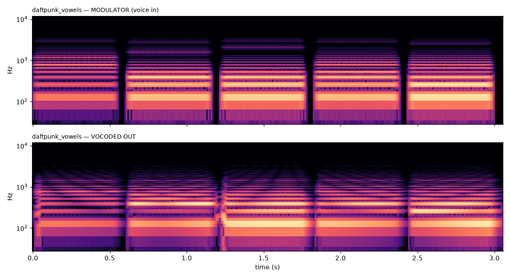
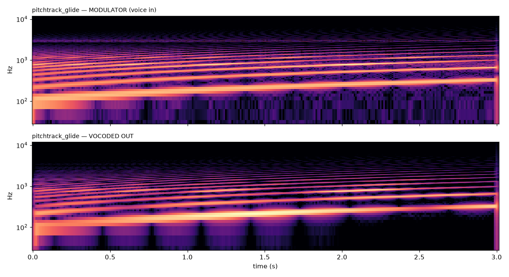
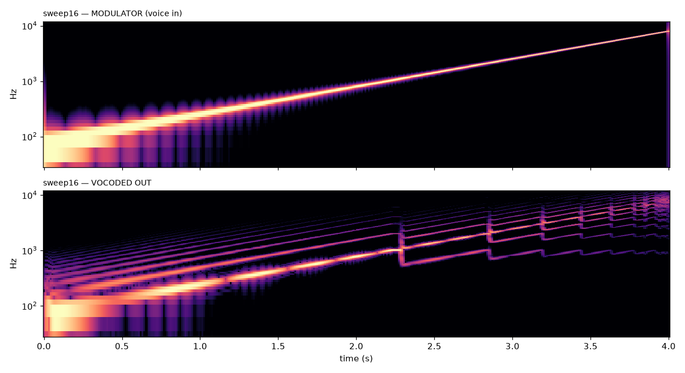
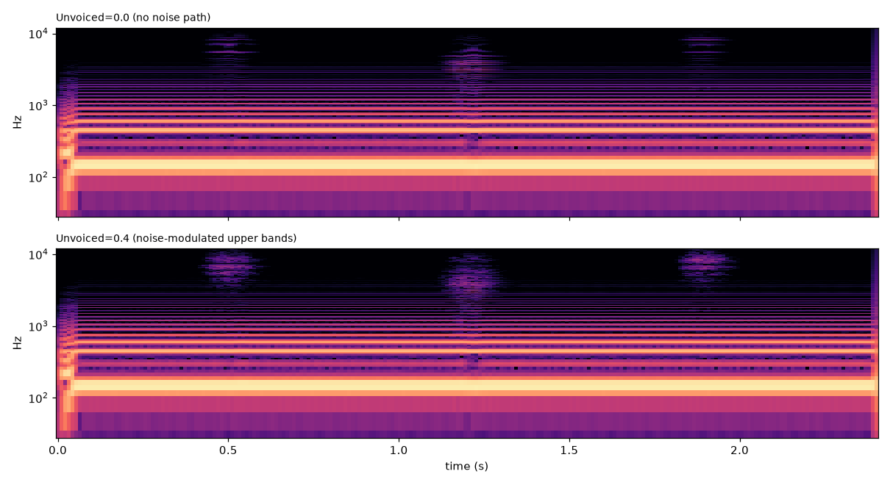
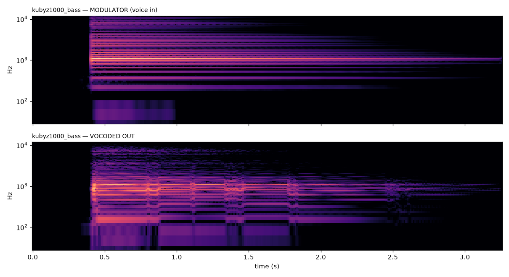

# SuperDuper Vocoder

A classic **multi-band channel vocoder** tuned for a robot-voice character —
Daft Punk / Kraftwerk / talkbox, plus a full family of jaw-harp (kubyz)
patches. Sing or talk into it and your voice drives a synthesized carrier
through a matched analysis/synthesis filter bank; the result is the timbre of
the carrier articulated by the words of your voice.

Ships as a `.clap` bundle with VST3 + AU wrappers (macOS arm64, Windows x64).
Part of the [SuperDuper DSP](../../README.md) suite.

| | |
|---|---|
| Category | Effect (audio-in → audio-out), MIDI note-in for carrier pitch |
| CLAP id | `co.superduperai.vocoder` |
| Inputs | Main stereo (modulator) + `Carrier` sidechain stereo (port 1) |
| Latency | **0 samples** — pure IIR, no lookahead. Live / direct-monitoring safe |
| Params | 13 (see below) · 20 factory presets |

---

## What it does

A vocoder splits the **modulator** (your voice) into frequency bands, measures
how much energy is in each band over time, and uses those per-band envelopes to
shape a **carrier** signal band-by-band. The voice provides the articulation;
the carrier provides the tone. Because the analysis and synthesis banks share
the exact same band centres, the carrier comes out wearing the voice's moving
formants — that is the whole trick.

```
  Main in (voice) ──► [16× band-pass] ──► [envelope follower ×16] ─┐
                          analysis bank                            │ per-band gain
                                                                   ▼
  Carrier ──────────► [16× band-pass] ──► × ──► Σ ──► drive ──► mix ──► out
   ├─ Internal osc (Saw/Square/Pulse/Saw+Sub), pitch-tracked by YIN
   ├─ …or MIDI notes (play chords on a keyboard — 6-voice polyphonic)
   └─ …or the Carrier sidechain input (feed any synth / kubyz / pad)
                          synthesis bank (± Formant Shift)
```

### DSP design

- **Analysis / synthesis banks** — 16 constant-Q band-pass channels, mel-spaced
  from ~80 Hz to ~8 kHz (denser through the 300 Hz–3 kHz formant region). Each
  channel is **two cascaded RBJ band-pass biquads** (4th-order, unity peak
  gain). The band count is switchable — **11 / 16 / 20** — which is really a
  character control: 11 is the tinny, classic-robot sound (à la DigiTech
  Talker), 20 is the intelligible, modern *Random Access Memories* sound.
- **Envelope followers** — one per band on the modulator, rectify + asymmetric
  one-pole (`Attack` / `Release`). Fast settings = choppy/robotic and
  articulate; slow settings = smooth/vowel-y and pad-like.
- **Carrier** — two selectable sources (`Source`):
  - **Internal** oscillators: band-limited **PolyBLEP** Saw / Square / Pulse /
    Saw+Sub, pitch-tracked off the voice by a streaming **YIN** detector (no
    keyboard needed), with a 2-oscillator detune spread for stereo width.
    Alternatively, drive the carrier pitch from **MIDI notes** — 6-voice
    polyphonic, so you can vocode whole chords from a keyboard. The tracked
    pitch is stabilised by a **median window + portamento glide**, so a
    harmonic-rich, plucky source (a jaw-harp strike) can't make the carrier
    octave-jump into a squeak on the attack — it locks to the fundamental.
  - **Sidechain**: the stereo `Carrier` input (port 1) is used directly as the
    carrier — feed it a synth, pad, drum loop, or a live/sampled kubyz.
- **Unvoiced path** — consonants (s / t / k / sh) are noise, not tone, and a
  pure-tone carrier loses them. `Unvoiced` cross-fades the upper (sibilant)
  bands of the carrier into **band-filtered white noise**, gated by the same
  per-band envelopes, so noise appears only where the voice actually has
  high-frequency energy. Two independent noise streams (L/R) keep sibilants
  stereo-wide. This is the classic Sennheiser VSM201 trick.
- **Formant Shift** — retunes the *synthesis* band centres relative to the
  analysis bank (`2^(semitones/12)`), for that shifted-throat robot timbre
  without changing pitch.
- **Drive** — `tanh` saturation on the summed wet signal for analog-vocoder
  grit (symmetric → no DC blocker needed).
- **Stereo** — the modulator analysis is mono-summed (a formant envelope is a
  mono quantity); the carrier and wet path are stereo (osc detune spread, or
  the stereo sidechain), so the robot has width without smearing the analysis.

---

## Parameters

| # | Name | Range | Default | What it does |
|---|------|-------|---------|--------------|
| 0 | Attack | 0.5–50 ms | 3 ms | Envelope attack. Fast = tight consonants |
| 1 | Release | 5–300 ms | 25 ms | Envelope release. Long = smeared / pad-like tails |
| 2 | Source | Internal / Sidechain | Internal | Carrier from built-in osc or the sidechain input |
| 3 | Wave | Saw / Square / Pulse / Saw+Sub | Saw | Internal carrier waveform |
| 4 | Pitch | −24…+24 st | 0 | Carrier pitch offset (on top of tracked/MIDI pitch) |
| 5 | Detune | 0–25 ct | 0 | 2-osc detune + stereo spread (internal carrier) |
| 6 | Formant | −12…+12 st | 0 | Shifts synthesis band centres — throat character |
| 7 | Unvoiced | 0–1 | 0.15 | Noise blend for sibilant intelligibility |
| 8 | Drive | 0–1 | 0 | `tanh` grit on the wet signal |
| 9 | Mix | 0–1 | 1.0 | Dry/Wet. Automate this for a voice→carrier morph |
| 10 | Output | −24…+24 dB | 0 | Output trim |
| 11 | Bands | 11 / 16 / 20 | 16 | Channel count = tinny ↔ intelligible character |
| 12 | Pitch Src | Auto / MIDI / Voice | Auto | Internal carrier pitch source (see below) |

**Pitch Src** — `Auto`: use held MIDI notes if any, otherwise track the voice
(YIN). `MIDI`: keyboard only (carrier is silent with no notes held, like a
hardware vocoder). `Voice`: YIN pitch-tracking only, no keyboard.

Every knob writes automation to the host, sends touch gesture begin/end, and
persists through project save and FX-chain presets. MIDI CC does **not** write
automation (no feedback loop).

---

## Presets

20 factory presets. The **kubyz family** (jaw-harp / khomus) is a first-class
citizen — the instrument is already vocoder-like (a harmonic drone shaped by
mouth formants), so it maps beautifully onto both sides of the vocoder.

### Core

| Preset | Bands | Use |
|--------|:-----:|-----|
| Default | 16 | Neutral starting point |
| Daft Punk Robot | 16 | Flagship robot — saw carrier, fast, formant −1, drive |
| Kraftwerk Choir | 20 | Wide choral pad — Saw+Sub, slow release |
| Talkbox | 11 | Reedy, tinny pulse honk |
| Sidechain Synth | 16 | Vocode a synth/pad on the Carrier input (chords) |
| Live Keys | 16 | Play chords on MIDI to pitch the robot voice |
| Subtle Doubler | 16 | Low Dry/Wet — thickens a natural vocal |

### Character

| Preset | Bands | Use |
|--------|:-----:|-----|
| Piezo Perc | 20 | Piezo/contact-mic FX — keeps attacks & scrapes, gritty |
| Deep Villain | 16 | Deep menacing robot — Saw+Sub −12, formant −5 |
| Dalek Scream | 11 | Harsh sci-fi villain — square, choppy, heavy drive |
| Angel Choir | 20 | Lush wide choir — Saw+Sub, wide detune, long release |
| Alien Formant | 16 | Chipmunk / alien throat — formant +9 |
| 8-Bit Vox | 11 | Lo-fi chiptune — pulse, dry |
| Analog 70s | 16 | Warm vintage (Roland SVC-350 / EMS) — `tanh` colour |
| Sci-Fi Texture | 16 | Ambient texture over a pad — sidechain, slow, wide |

### Kubyz family

| Preset | Bands | Use |
|--------|:-----:|-----|
| Kubyz Bass | 20 | Kubyz → talking sub bass (Saw+Sub, Pitch −12 = real sub) |
| Kubyz Drone | 20 | Slow envelope smears the mouth-wah into an evolving pad |
| Kubyz Lead | 20 | Play a melody on keys; kubyz gives it living formant articulation |
| Kubyz Growl | 16 | Aggressive Reese-style bass growl — wide detune + drive |
| Voice→Kubyz | 20 | Your voice plays *through* a kubyz carrier (sidechain) |

---

## Verified by spectral analysis

The plugin was audited offline by rendering test signals through the real DSP
and studying input-vs-output spectrograms (2048-pt STFT), not just by unit
tests. Every result below is confirmed by the pictures in [`docs/audit/`](docs/audit).

**Formant transfer works** — feeding an `a-e-i-o-u` vowel sequence, the output
formant bands land exactly on the modulator's formants and shift vowel-to-vowel.
The saw carrier is genuinely wearing the voice's formants.



**Pitch tracking works** — on a 110→330 Hz glide, the output harmonic comb
rises in lock-step with the input; the internal carrier's YIN tracker follows
the voice with no keyboard.



**Band structure is real** — an 80 Hz→8 kHz sweep shows the classic vocoder
"staircase": output energy quantises into the discrete synthesis bands as the
sweep crosses band boundaries.



**Unvoiced restores consonants** — at `Unvoiced = 0.4`, high-frequency energy in
the sibilant windows is **~2.7× higher** than at 0 (0.128 vs 0.047), turning
thin, tonal consonants into full noise bursts.



**Kubyz makes a talking bass** — a real jaw-harp recording as the modulator
yields genuine low end plus the transferred mouth formants — a bass that
articulates. `Kubyz Bass` defaults to Pitch −12, dropping the fundamental an
octave into true sub territory (measured 218 Hz → 78 Hz).



### Tuning applied after the audit

- **Band-count loudness matched.** The makeup-gain compensation was scaling the
  wrong way (`sqrt(16/n)` left 20-band output ~5 dB quiet). It is now linear in
  band count — measured loudness across 11 / 16 / 20 matches within ~0.2 dB, so
  switching band counts live no longer jumps level.
- **Kubyz Bass → real sub.** Default Pitch set to −12 (the carrier locks to a
  low kubyz harmonic, not the weak 73 Hz fundamental, so it needed the octave
  down).
- **Stability.** All rendered outputs are finite — zero NaNs/denormals (FTZ
  guard in `process()`), verified over multi-second silence tails.

---

## Recipes

### Daft Punk robot voice
1. Put a **compressor on the voice *before* the vocoder** (Pump/FET, 4–6 dB GR).
   Evening out the modulator's dynamics keeps the per-band envelopes steady —
   this is the single most important pre-step.
2. Vocoder → preset **Daft Punk Robot**. Sing on pitch; the YIN tracker follows.
3. After the vocoder: EQ + a touch of reverb to seat it in the mix.

### Voice → kubyz morph (a phrase that ends as a jaw-harp)
1. Voice → main input. A kubyz (**sample or live**) → the **Carrier** sidechain
   input (Source = Sidechain). Preset **Voice→Kubyz**.
2. Automate **Dry/Wet** (Mix): dry through the phrase, ramping wet toward the
   ending.
3. The long release rings the phrase tail out as a voice-shaped kubyz drone —
   the words dissolve into the jaw-harp.

### Live MIDI chords
Route a MIDI keyboard to the vocoder's FX track, set **Pitch Source = Auto**,
and play chords under your voice — the robot sings the notes you play (6-voice
polyphonic). Zero latency and denormal-safe for live sets.

### Kubyz family
Kubyz can sit on **either** side of the vocoder:
- **As modulator** (its mouth-wah drives the bands): `Kubyz Bass` (sub),
  `Kubyz Drone` (ambient pad), `Kubyz Lead` (play the melody on keys), `Kubyz
  Growl` (Reese bass).
- **As carrier** (sidechain, kubyz is the tone): `Voice→Kubyz`, or route a
  drum loop as the modulator for rhythmic kubyz stutters.

---

## Sidechain routing (REAPER)

To use the `Carrier` sidechain input:
1. Right-click the plugin in the FX chain → **Pin Connector**.
2. Set the track to 4 channels (right-click track → I/O → 4 channels out).
3. Route the carrier source (synth / kubyz) into track channels 3–4, and pin
   those to the plugin's sidechain pins (3–4).

If nothing is routed to the sidechain, the internal oscillator is used instead
(so `Source = Internal` presets work out of the box).

---

## Build & install

```bash
# from the workspace root
./scripts/build_vocoder_bundle.sh          # builds + installs the .clap
cargo test --release -p superduper-vocoder # 17 test functions
```

Installs to `~/Library/Audio/Plug-Ins/CLAP/SuperDuperVocoder.clap`. In REAPER,
if a rebuild doesn't show up: Preferences → Plug-ins → CLAP → **Clear cache and
re-scan**. The `[bNNNNN]` build number in the display name tells you which build
is loaded.

### Tests

| File | Checks |
|------|--------|
| `tests/dsp_smoke.rs` | RMS/peak/stability, all-presets-in-range, denormal-silence-stays-finite |
| `tests/clap_e2e.rs` | Loads + processes through the full CLAP pipeline |
| `tests/midi_carrier.rs` | MIDI NoteOn pitches the carrier; silent with no notes in MIDI mode |
| `tests/spectrum.rs` | Band centres + comb structure on tonal / broadband input |
| `tests/quality_audit.rs` | PolyBLEP carrier THD / aliasing vs a naive saw |
| `tests/pitch_stability.rs` | Carrier holds the bass fundamental on a plucky jaw-harp (no octave-squeak regression) |

### Source-level tuning knobs

In `src/dsp.rs`: `VOC_MAKEUP` (robot-voice loudness), the per-band `Q` clamp
`[1.5, 9.0]` in `Vocoder::new` (band isolation vs smoothness), and the unvoiced
noise ramp (3 kHz → 5 kHz). Nudge to taste.
