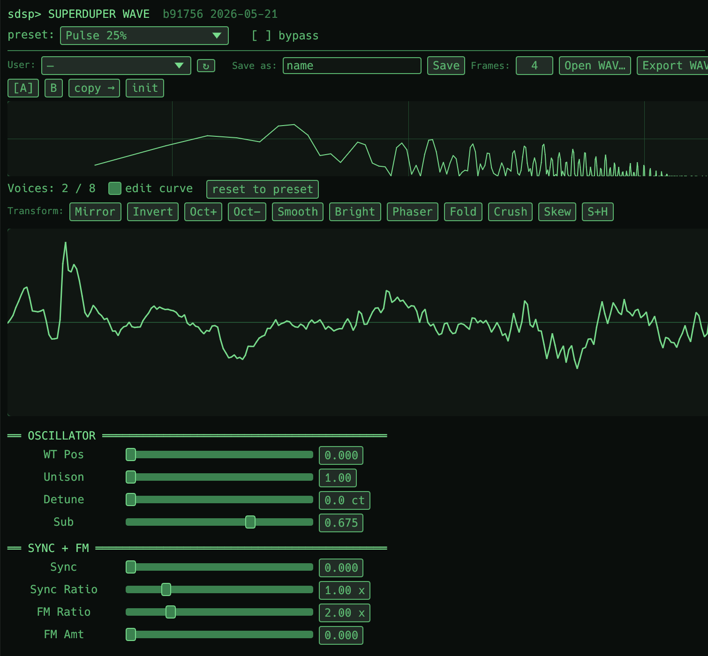

# SuperDuper Wave

Wavetable bass/lead synth with mouse-editable curve, multi-frame
storage (1..16 frames), 11 wavetable transforms, smart WAV import,
and Serum-compatible export.

| | |
|---|---|
| Category | Instrument (MIDI-in → audio-out) |
| Stereo | yes (unison detune-spread) |
| Latency | 0 samples |

## Engine

- **Per voice** — mip-mapped anti-aliased wavetable + unison (up to 7
  detuned copies) + sub oscillator + noise + multi-mode filter +
  filter env + LFO with 3 destinations + amp env.
- **Polyphony** — 8 voices, click-free voice steal.

## Wavetables

- **Multi-frame storage**: 1..16 frames per table. `WT Pos` morphs
  linearly between adjacent frames — sweep the whole set with one
  knob, a CC, or an envelope.
- **Editable curve** — click + drag points on the visualiser
  (Catmull-Rom + RDP simplify + Undo/Redo). Changes update the next
  time the voice reads.
- **Anti-aliasing** — mip-mapped pyramid (8 levels), per-voice
  band-limited reads. Off mode for raw aliasing if you want it.

## Smart WAV import

Drop a `.wav` on `Open WAV` — the importer:

1. **YIN pitch detect** to find the fundamental
2. **Cycle extract** at the detected pitch
3. **Normalise** to ±1.0 peak
4. **Slot as frame_a** (or as N evenly-spaced cycles when N≥2)

Loads kubyz / vocal / synth recordings into proper wavetables instead
of linear-resampling the whole file. Multi-frame import extracts N
evenly-spaced cycles for timbre evolution.

## Serum-style export

`Save .wav` writes:

- **N=1** → single-cycle WAV (256-sample standard)
- **N≥2** → stitched `N × WT_SIZE` samples concatenated, readable
  directly by Serum, Vital, Phase Plant. Auto-detected on re-import:
  file length divisible by WT_SIZE → split into N frames.

Companion `.json` preserves the synth state so patches round-trip.

## 11 wavetable transforms

One-click curves derived from the current frame:

| Transform | Effect |
|---|---|
| **Mirror** | Reverse along the time axis. Phase-only. |
| **Invert** | Multiply by -1. Phase-only. |
| **Octave +** | Halve period → octave up. |
| **Octave −** | Stretch period → octave down. |
| **Smooth** | Low-pass via sliding-window mean. |
| **Bright** | Centred derivative emphasis, n/16 scale. |
| **Phaser** | All-pass-like frequency-dependent shift. |
| **Fold** | Wavefolder — peaks fold back into the wave. |
| **Crush** | Bitcrush quantisation. |
| **Skew** | Time-skew the curve asymmetrically. |
| **S+H** | Sample-and-hold staircase quantisation. |

Stackable + Undo/Redo. Spectral diffs per transform are reported by
the `wave-inspect` CLI.

## MIDI mapping (defaults)

| CC | Param |
|---|---|
| CC 1 | LFO Depth |
| CC 11 | Cutoff |
| CC 71 | Resonance |
| CC 74 | WT Pos |
| Aftertouch (channel) | LFO Depth |

Right-click any knob → MIDI Learn to remap.

## User presets

Save/Load buttons → `~/.superduper-dsp/wave/presets/<name>.json` +
sibling `<name>.wav`. `last.json` auto-saves on every edit and
becomes the default for fresh plugin instances.
